# BudgetWise Class Diagram

This document contains the class diagram representing the architecture of the BudgetWise application.

## Class Diagram

```mermaid
classDiagram
    direction TB
    
    %% Types/Models
    class Account {
        +string id
        +string name
        +string description
        +number amount
        +AccountIcon icon
        +AccountColor color
        +string customColor
        +AccountItem[] items
        +string[] tagIds
        +string createdAt
        +string updatedAt
    }
    
    class AccountItem {
        +string id
        +string name
        +number cost
    }
    
    class Tag {
        +string id
        +string name
        +AccountColor color
        +string customColor
        +TagEntityType entityType
        +string createdAt
        +string updatedAt
    }
    
    class Chain {
        +string id
        +string name
        +string description
        +AccountColor color
        +string customColor
        +ChainAccountConfig[] accounts
        +number bufferAmount
        +boolean hasBufferAccount
        +string bufferAccountId
        +DistributionMode distributionMode
        +string createdAt
        +string updatedAt
    }
    
    class ChainAccountConfig {
        +string accountId
        +number limit
        +number percentage
        +number order
    }
    
    class AccountRule {
        +string id
        +string sourceAccountId
        +DayOfWeek dayOfWeek
        +number dayOfMonth
        +RuleFrequency frequency
        +number thresholdAmount
        +AllocationTarget[] targets
        +boolean enabled
        +string lastExecuted
        +string createdAt
        +string updatedAt
    }
    
    class AllocationTarget {
        +string accountId
        +number percentage
        +AllocationMode mode
        +number amount
    }
    
    class Transaction {
        +string id
        +TransactionType type
        +TransactionEntityType entityType
        +string entityId
        +string entityName
        +number amount
        +number balanceAfter
        +string description
        +string[] tagIds
        +string createdAt
    }
    
    class TransactionStorage {
        +Record~number, YearlyTransactions~ years
    }
    
    class FontConfig {
        +string id
        +string name
        +string family
        +string googleFontsUrl
        +boolean isCustom
    }
    
    class FontSettings {
        +string activeFontId
        +FontConfig[] customFonts
    }
    
    class ThemeProfile {
        +string id
        +string name
        +ThemeColors lightColors
        +ThemeColors darkColors
        +string createdAt
        +string updatedAt
    }
    
    class ThemeColors {
        +string primary
        +string secondary
        +string accent
        +string background
        +string foreground
        +string muted
    }
    
    class YearlyTransactions {
        +number year
        +Record~number, Transaction[]~ months
    }
    
    %% Services
    class AccountService {
        +getAllAccounts() Account[]
        +getAccountById(id) Account
        +createAccount(data) Account
        +updateAccount(id, data) Account
        +deleteAccount(id) boolean
    }
    
    class ChainService {
        +getAllChains() Chain[]
        +getChainById(id) Chain
        +createChain(data) Chain
        +updateChain(id, data) Chain
        +deleteChain(id) boolean
    }
    
    class TagService {
        +getAllTags() Tag[]
        +getTagsByEntityType(type) Tag[]
        +getTagById(id) Tag
        +createTag(data) Tag
        +updateTag(id, data) Tag
        +deleteTag(id) boolean
    }
    
    class RuleService {
        +getAllRules() AccountRule[]
        +getRuleById(id) AccountRule
        +createRule(data) AccountRule
        +updateRule(id, data) AccountRule
        +deleteRule(id) boolean
        +executeRule(rule, accounts) Account[]
    }
    
    class TransactionService {
        +getAllTransactions() TransactionStorage
        +createTransaction(data) Transaction
        +deleteTransaction(id) boolean
        +getTransactionsForYear(year) Transaction[]
        +getTransactionsForMonth(year, month) Transaction[]
        +getFilteredTransactions(filter) Transaction[]
        +getTransactionSummary(filter) TransactionSummary
        +deleteTransactionsForMonth(year, month) number
        +deleteTransactionsForYear(year) number
    }
    
    class DepositService {
        +depositToChain(chainId, amount, accounts) DepositResult
        +depositToChainByPercentage(chain, amount, accounts) DepositResult
        +depositToChainSequential(chain, amount, accounts) DepositResult
        +applyDeposits(deposits, accounts) Account[]
        +withdrawFromChain(chainId, amount, accounts) DepositResult
    }
    
    class ExportService {
        +exportToJSON() void
        +exportToExcel() void
    }
    
    class ImportService {
        +importFromJSON(file) ImportResult
        +importFromExcel(file) ImportResult
        +importFromFile(file) ImportResult
    }
    
    class FontService {
        +loadFontSettings() FontSettings
        +saveFontSettings(settings) void
        +loadCustomFonts() FontConfig[]
        +saveCustomFonts(fonts) void
        +parseFontNameFromUrl(url) string
        +parseAllFontNamesFromUrl(url) string[]
        +createSingleFontUrl(url, fontName) string
        +isValidGoogleFontsUrl(url) boolean
        +addCustomFont(url) FontConfig
        +removeCustomFont(fontId) boolean
        +getAllFonts() FontConfig[]
        +getFontById(fontId) FontConfig
        +loadFontStylesheet(font) void
        +applyFont(font) void
    }
    
    %% Contexts
    class AccountContext {
        +state AccountState
        +createAccount(data) Account
        +updateAccount(id, data) Account
        +deleteAccount(id) boolean
        +depositToAccount(id, amount, tagIds, description) Account
        +withdrawFromAccount(id, amount, tagIds, description) Account
        +updateAccountsFromDeposit(accounts) void
    }
    
    class ChainContext {
        +state ChainState
        +createChain(data) Chain
        +updateChain(id, data) Chain
        +deleteChain(id) boolean
        +addAccountToChain(chainId, accountId) Chain
        +removeAccountFromChain(chainId, accountId) Chain
        +reorderChainAccounts(chainId, configs) Chain
        +updateAccountLimitInChain(chainId, accountId, limit) Chain
        +toggleBufferAccount(chainId) Chain
        +updateBufferAmount(chainId, amount) Chain
        +setBufferAccount(chainId, accountId) Chain
        +toggleDistributionMode(chainId) Chain
    }
    
    class TagContext {
        +state TagState
        +createTag(data) Tag
        +updateTag(id, data) Tag
        +deleteTag(id) boolean
        +getTagById(id) Tag
        +getTagsByIds(ids) Tag[]
        +getTagsByEntityType(type) Tag[]
    }
    
    class RuleContext {
        +state RuleState
        +createRule(data) AccountRule
        +updateRule(id, data) AccountRule
        +deleteRule(id) boolean
        +toggleRule(id) AccountRule
        +executeRuleManually(id) boolean
    }
    
    class TransactionContext {
        +state TransactionStorage
        +selectedYear number
        +selectedMonth number
        +summary TransactionSummary
        +createTransaction(data) Transaction
        +deleteTransaction(id, year, month) boolean
        +deleteTransactionsForPeriod(year, month) number
        +setSelectedYear(year) void
        +setSelectedMonth(month) void
    }
    
    class ThemeContext {
        +theme string
        +toggleTheme() void
        +setTheme(theme) void
    }
    
    class ThemeCustomizationContext {
        +profiles ThemeProfile[]
        +activeProfile ThemeProfile
        +fontSettings FontSettings
        +allFonts FontConfig[]
        +activeFont FontConfig
        +createProfile(data) ThemeProfile
        +updateProfile(id, data) ThemeProfile
        +deleteProfile(id) boolean
        +setActiveProfile(id) void
        +setActiveFont(fontId) void
        +addCustomFont(url) FontConfig
        +removeCustomFont(fontId) boolean
        +resetToDefault() void
    }
    
    class TutorialContext {
        +state TutorialState
        +currentStep TutorialStep
        +startTutorial() void
        +stopTutorial() void
        +nextStep() void
        +previousStep() void
        +goToStep(index) void
        +completeTutorial() void
    }
    
    %% Components
    class AccountCard {
        +account Account
        +compact boolean
        +onEdit(account) void
        +onDeposit(account) void
        +onWithdraw(account) void
    }
    
    class AccountForm {
        +isOpen boolean
        +account Account
        +availableTags Tag[]
        +existingAccounts Account[]
        +onClose() void
        +onSubmit(data) void
        +onDelete() void
        +onCreateTag(data) void
    }
    
    class TransactionModal {
        +isOpen boolean
        +account Account
        +type TransactionType
        +availableTags Tag[]
        -description string
        +onClose() void
        +onSubmit(accountId, amount, tagIds, description) void
        +onCreateTag(data) void
    }
    
    class ChainDepositModal {
        +isOpen boolean
        +chain Chain
        +accounts Account[]
        -description string
        -saveForFuture boolean
        -savedDescriptions string[]
        +onClose() void
        +onConfirmDeposit(result, description) void
    }
    
    class ChainDisplay {
        +chain Chain
        +accounts Account[]
        +onEdit(chain) void
        +onDelete(chain) void
        +onDeposit(chain) void
        +onManageAccounts(chain) void
    }
    
    class TagList {
        +tags Tag[]
        +accounts Account[]
        +entityType TagEntityType
        +onEditTag(id, data) void
        +onDeleteTag(id) void
        +onCreateTag(data) void
    }
    
    class TransactionsPage {
        -typeFilter string
        -entityFilter string
        -deleteTarget Transaction
        +handleDeleteTransaction(transaction) void
        +handleBulkDelete() void
    }
    
    %% Relationships - Types
    Account "1" *-- "0..*" AccountItem : contains
    Chain "1" *-- "0..*" ChainAccountConfig : contains
    AccountRule "1" *-- "1..*" AllocationTarget : has
    TransactionStorage "1" *-- "0..*" YearlyTransactions : organizes
    YearlyTransactions "1" *-- "0..*" Transaction : contains
    
    %% Relationships - Service Layer
    AccountService ..> Account : manages
    ChainService ..> Chain : manages
    TagService ..> Tag : manages
    RuleService ..> AccountRule : manages
    TransactionService ..> Transaction : manages
    DepositService ..> Chain : uses
    DepositService ..> Account : updates
    FontService ..> FontConfig : manages
    FontService ..> FontSettings : manages
    
    %% Relationships - Context Layer
    AccountContext --> AccountService : uses
    ChainContext --> ChainService : uses
    TagContext --> TagService : uses
    RuleContext --> RuleService : uses
    TransactionContext --> TransactionService : uses
    ThemeCustomizationContext --> FontService : uses
    ThemeCustomizationContext --> ThemeProfile : manages
    
    %% Relationships - UI Layer
    AccountCard --> Account : displays
    AccountForm --> Account : creates/edits
    AccountForm --> Tag : selects
    ChainDisplay --> Chain : displays
    ChainDisplay --> Account : shows
    TagList --> Tag : displays
    TransactionsPage --> TransactionContext : uses
```



## Architecture Layers

### 1. Types/Models Layer (`/app/types/`)
Core data structures and interfaces used throughout the application.

### 2. Services Layer (`/app/services/`)
Business logic and data persistence operations. Each service handles CRUD operations for its respective entity.

### 3. Context Layer (`/app/context/`)
React Context providers that manage global state and expose actions to components.

### 4. Components Layer (`/app/components/`)
UI components organized by feature (account, chain, tag, shared, layout, tutorial).

## Key Design Patterns

1. **Service Pattern**: Encapsulates data access logic in service modules
2. **Context + Reducer Pattern**: Global state management with React Context and useReducer
3. **Component Composition**: Small, reusable components combined to build complex UIs
4. **Feature-based Organization**: Components organized by domain feature

## Data Flow

```
User Action → Component → Context Action → Service → LocalStorage
     ↑                                         ↓
     └──────────── State Update ←──────────────┘
```
