# BudgetWise Entity Relationship Diagram

This document contains the ERD diagram representing the data model of the BudgetWise application.

## Entity Relationship Diagram

```mermaid
erDiagram
    ACCOUNT ||--o{ ACCOUNT_ITEM : contains
    ACCOUNT ||--o{ ACCOUNT_TAG : has
    ACCOUNT }o--o{ CHAIN_ACCOUNT_CONFIG : "belongs to"
    ACCOUNT ||--o{ ALLOCATION_TARGET : "is target of"
    ACCOUNT ||--o{ ACCOUNT_RULE : "is source for"
    ACCOUNT ||--o{ TRANSACTION : "records"
    ACCOUNT |o--o{ CHAIN : "can be buffer for"
    
    TAG ||--o{ ACCOUNT_TAG : "applied to"
    TAG ||--o{ TRANSACTION_TAG : "applied to"
    
    CHAIN ||--o{ CHAIN_ACCOUNT_CONFIG : contains
    
    ACCOUNT_RULE ||--o{ ALLOCATION_TARGET : has
    
    TRANSACTION ||--o{ TRANSACTION_TAG : has
    
    FONT_SETTINGS ||--o{ FONT_CONFIG : "uses custom"
    THEME_PROFILE ||--|{ THEME_COLORS : "has light/dark"
    
    ACCOUNT {
        string id PK
        string name
        string description
        number amount
        string icon
        string color
        string customColor
        string[] tagIds
        string createdAt
        string updatedAt
    }
    
    ACCOUNT_ITEM {
        string id PK
        string name
        number cost
    }
    
    TAG {
        string id PK
        string name
        string color
        string customColor
        string entityType "account|transaction"
        string createdAt
        string updatedAt
    }
    
    CHAIN {
        string id PK
        string name
        string description
        string color
        string customColor
        number bufferAmount
        boolean hasBufferAccount
        string bufferAccountId FK "optional: use existing account as buffer"
        string distributionMode "sequential|percentage"
        string createdAt
        string updatedAt
    }
    
    CHAIN_ACCOUNT_CONFIG {
        string accountId FK
        number limit
        number percentage
        number order
    }
    
    ACCOUNT_RULE {
        string id PK
        string sourceAccountId FK
        number dayOfWeek
        number dayOfMonth
        string frequency "weekly|fortnightly|monthly|annually"
        number thresholdAmount
        boolean enabled
        string lastExecuted
        string createdAt
        string updatedAt
    }
    
    ALLOCATION_TARGET {
        string accountId FK
        number percentage
        string mode "percentage|amount"
        number amount
    }
    
    TRANSACTION {
        string id PK
        string type "deposit|withdraw"
        string entityType "account|chain"
        string entityId FK
        string entityName
        number amount
        number balanceAfter
        string description
        string[] tagIds
        string createdAt
    }
    
    TRANSACTION_STORAGE {
        object years
    }
    
    YEARLY_TRANSACTIONS {
        number year
        object months
    }

    ACCOUNT_TAG {
        string accountId FK
        string tagId FK
    }
    
    TRANSACTION_TAG {
        string transactionId FK
        string tagId FK
    }
    
    FONT_CONFIG {
        string id PK
        string name
        string family
        string googleFontsUrl
        boolean isCustom
    }
    
    FONT_SETTINGS {
        string activeFontId FK
    }
    
    THEME_PROFILE {
        string id PK
        string name
        string createdAt
        string updatedAt
    }
    
    THEME_COLORS {
        string primary
        string secondary
        string accent
        string background
        string foreground
        string muted
    }
    
    CUSTOM_COLORS {
        string[] colors
    }
    
    SAVED_CHAIN_DESCRIPTIONS {
        string[] descriptions
    }
```

## Entity Descriptions

### Core Entities

| Entity | Description |
|--------|-------------|
| **Account** | Budget category that holds a monetary balance. Supports negative balances for debt modeling. Can have items, tags, and participate in chains/rules. |
| **AccountItem** | Individual expense item within an account (e.g., gym membership, chalk for climbing). |
| **Tag** | Label for organizing accounts or transactions. Differentiated by entityType. |
| **Chain** | Ordered list of accounts for automated deposit distribution. Supports sequential and percentage modes. |
| **AccountRule** | Automated rule for periodic fund allocation from a source account. |
| **Transaction** | Record of a deposit or withdrawal with timestamp and balance snapshot. |

### Settings Entities

| Entity | Description |
|--------|-------------|
| **FontConfig** | Configuration for a font including Google Fonts URL and display name. |
| **FontSettings** | User's active font selection and custom fonts. |
| **ThemeProfile** | Custom theme profile with light and dark color schemes. |
| **ThemeColors** | Color scheme for a theme (primary, secondary, accent, etc.). |
| **CustomColors** | User-saved custom colors for reuse in accounts, tags, and chains. |
| **SavedChainDescriptions** | User-saved descriptions for chain deposits, reusable for future transactions. |

### Relationship Entities (Join Tables)

| Entity | Description |
|--------|-------------|
| **ChainAccountConfig** | Configuration for an account within a chain (order, limit, percentage). |
| **AllocationTarget** | Target account in an allocation rule with percentage or fixed amount. |
| **AccountTag** | Many-to-many relationship between accounts and tags. |
| **TransactionTag** | Many-to-many relationship between transactions and tags. |

### Storage Structures

| Entity | Description |
|--------|-------------|
| **TransactionStorage** | Top-level storage container for all transactions. |
| **YearlyTransactions** | Year-grouped container of monthly transaction arrays. |

## Key Relationships

1. **Account ↔ Chain**: Many-to-many through ChainAccountConfig
2. **Account ↔ Tag**: Many-to-many through embedded tagIds array
3. **Account → AccountRule**: One account can be the source for multiple rules
4. **AccountRule → AllocationTarget**: One rule can have multiple allocation targets
5. **Transaction → Account**: Each transaction references an account (entityId)
6. **Transaction ↔ Tag**: Many-to-many through embedded tagIds array

## Data Storage

All entities are stored in localStorage using the following keys:
- `budgetwise_accounts` - Account[]
- `budgetwise_chains` - Chain[]
- `budgetwise_tags` - Tag[]
- `budgetwise_rules` - AccountRule[]
- `budgetwise_transactions` - TransactionStorage
- `budget-wise-custom-colors` - string[] (hex colors)
- `budget-wise-custom-fonts` - FontConfig[]
- `budget-wise-active-font` - FontSettings
- `budget-wise-saved-chain-descriptions` - string[] (saved descriptions for chain deposits)
- `budgetwise-theme-profiles` - ThemeProfile[]
- `budgetwise-active-profile` - string (profile ID)
